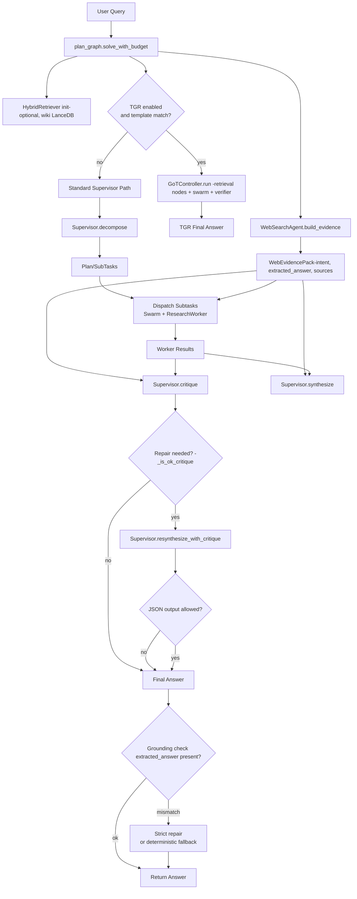

# Multi-Agent Reasoning System — Architecture & Methodology

This document provides a comprehensive deep-dive into MAS architecture, covering the Retrieval-Augmented Templated Graph Reasoning (RA-TGR) pipeline, hybrid fusion RAG, multi-agent orchestration, and intelligent output formatting.

---

## Table of Contents

1. [System Overview](#system-overview)
2. [High-Level Architecture](#high-level-architecture)
3. [Core Components](#core-components)
4. [End-to-End Flow](#end-to-end-flow)
5. [Real-Time Web Search Agent](#real-time-web-search-agent)
6. [Retrieval-Augmented Generation (RAG) System](#retrieval-augmented-generation-rag-system)
7. [Templated Graph Reasoning (TGR)](#templated-graph-reasoning-tgr)
8. [RA-TGR: The Unified Pipeline](#ra-tgr-the-unified-pipeline)
9. [Question Type Detection & Output Formatting](#question-type-detection--output-formatting)
10. [Consensus & Verification](#consensus--verification)
11. [Configuration & Models](#configuration--models)
12. [Entry Points & Benchmarks](#entry-points--benchmarks)
13. [Code Organization](#code-organization)

---

## System Overview

MAS is a sophisticated multi-agent reasoning system that combines:

- **Real-Time Web Search**: Dedicated WebSearchAgent for current events and live information
- **Hybrid Fusion RAG**: Semantic (dense vector) + Lexical (BM25) retrieval with Reciprocal Rank Fusion
- **Templated Graph Reasoning (TGR)**: Buffer-of-Thought templates + Graph-of-Thought execution
- **Multi-Model Swarm Consensus**: Parallel LLM calls with cooperative reconciliation
- **Code-First Research**: Ouroboros loop with sandboxed Python execution
- **Intelligent Output Formatting**: Question-type-aware synthesis for optimal response formats

```text
User Query
   │
   ▼
┌─────────────────────────────────────────────────────────────────┐
│                    RAG-Enhanced Template Distiller              │
│  ┌─────────────┐    ┌──────────────┐    ┌──────────────────┐   │
│  │ LanceDB     │───▶│ Fusion Search │───▶│ Template Selection│   │
│  │ Vector Store│    │ (Sem + Lex)  │    │ with RAG Boost    │   │
│  └─────────────┘    └──────────────┘    └──────────────────┘   │
└───────────────────────────────┬─────────────────────────────────┘
                                │
         ┌──────────────────────┴──────────────────────┐
         ▼                                             ▼
┌─────────────────────┐                    ┌─────────────────────┐
│   TGR Fast-Path     │                    │   Standard Path     │
│   (GoTController)   │                    │   (Supervisor)      │
│                     │                    │                     │
│ ┌─────────────────┐ │                    │ ┌─────────────────┐ │
│ │ Retrieval Nodes │ │                    │ │ Problem Decomp  │ │
│ │ Definition Nodes│ │                    │ │ Swarm Workers   │ │
│ │ Calculation     │ │                    │ │ Research Worker │ │
│ │ Verification    │ │                    │ │ Critique Loop   │ │
│ └─────────────────┘ │                    │ └─────────────────┘ │
└──────────┬──────────┘                    └──────────┬──────────┘
           │                                          │
           └──────────────────┬───────────────────────┘
                              ▼
              ┌───────────────────────────────┐
              │   Question-Type-Aware         │
              │   Synthesis & Formatting      │
              │                               │
              │ • Numeric → bare number       │
              │ • Boolean → yes/no            │
              │ • Multi-value → JSON          │
              │ • Explanatory → prose         │
              │ • Factual → concise answer    │
              └───────────────────────────────┘
                              │
                              ▼
                       Final Answer
```

---

## High-Level Architecture

### Component Hierarchy

```text
apps/mas/
├── agents/                    # Worker agents and supervisor
│   ├── supervisor.py          # Orchestration, decomposition, synthesis
│   ├── websearch.py           # Real-time web search agent (NEW)
│   ├── swarm_worker.py        # Multi-model parallel consensus
│   ├── worker_math.py         # Mathematical reasoning
│   ├── worker_logic.py        # Logical reasoning
│   ├── worker_qa.py           # Question answering
│   ├── worker_researcher.py   # Code-first research (Ouroboros)
│   └── verifier.py            # Numeric verification
│
├── graph/                     # TGR and orchestration
│   ├── plan_graph.py          # Main entry: solve_with_budget()
│   ├── template_distiller.py  # Template selection (keyword + RAG)
│   ├── got_controller.py      # Graph-of-Thought execution
│   └── archetype_verifier.py  # Domain-specific answer clamping
│
├── rag/                       # Retrieval-Augmented Generation
│   ├── embeddings.py          # Codestral embedder (1536-dim)
│   ├── indexer.py             # Wikipedia → LanceDB ingestion
│   ├── retriever.py           # Hybrid fusion search (RRF)
│   ├── chunker.py             # Document chunking strategies
│   └── tests/                 # Smoke tests for RAG
│
├── infra/                     # Infrastructure
│   ├── openrouter/client.py   # LLM API client with retries
│   ├── env.py                 # Environment configuration
│   └── hf_runner.py           # HuggingFace models (experimental)
│
├── tools/                     # Execution tools
│   ├── executor.py            # Sandboxed Python executor
│   └── search.py              # DuckDuckGo web search (NEW)
│
├── configs/                   # Configuration
│   ├── openrouter.yaml        # Main config (models, RAG, TGR)
│   └── templates/             # TGR template blueprints
│       ├── hotel_toggle_v1.json
│       ├── spectral_cayley_v1.json
│       ├── rank1_matrices.json
│       └── ...
│
└── web/                       # User interface
    └── chat_ui.py             # Gradio chat interface
```

### Architecture Diagrams (High-Level → Low-Level)

The current architecture is best understood as **RA‑TGR + Web Evidence + Grounded Synthesis**.

#### Diagram 1 — High-Level Pipeline (RA‑TGR + Web Evidence Layer)



#### Diagram 2 — Standard Path Sequence (solve_with_budget)


---

## Core Components

| Component | Role | Key File |
|-----------|------|----------|
| **SupervisorAgent** | Problem decomposition, critique, synthesis, repair | `agents/supervisor.py` |
| **WebSearchAgent** | Real-time web search for current events | `agents/websearch.py` |
| **SwarmWorkerManager** | Parallel multi-model consensus with cooperative rounds | `agents/swarm_worker.py` |
| **ResearchWorker** | Code-first Ouroboros loop with sandboxed execution | `agents/worker_researcher.py` |
| **VerifierAgent** | Independent numeric recomputation | `agents/verifier.py` |
| **TemplateDistiller** | Keyword-based template selection | `graph/template_distiller.py` |
| **RAGTemplateDistiller** | RAG-augmented template selection | `graph/template_distiller.py` |
| **GoTController** | Template DAG execution with RAG nodes | `graph/got_controller.py` |
| **HybridRetriever** | Semantic + Lexical fusion search (RRF) | `rag/retriever.py` |
| **CodestralEmbedder** | Dense embeddings via mistralai/codestral-embed-2505 | `rag/embeddings.py` |
| **WikipediaIndexer** | Document ingestion and indexing | `rag/indexer.py` |
| **OpenRouterClient** | LLM API wrapper with retries/timeouts | `infra/openrouter/client.py` |
| **search_web** | DuckDuckGo web search (news + text) | `tools/search.py` |

---

## End-to-End Flow

### Primary Execution Path

The main orchestrator is `solve_with_budget()` in `apps/mas/graph/plan_graph.py`:

```text
solve_with_budget(problem, config, timeout=300s)
    │
    ├─► [1] Initialize Components
    │       • OpenRouterClient (LLM access)
    │       • SwarmWorkerManager (parallel models)
    │       • ResearchWorker (code execution)
    │       • VerifierAgent (numeric checks)
    │       • HybridRetriever (RAG, if enabled)
    │       • RAGTemplateDistiller (template selection)
    │
    ├─► [2] TGR Fast-Path Attempt
    │       IF rag_enabled:
    │           distiller.select_with_rag(problem) → (template, score, context)
    │       ELSE:
    │           distiller.select(problem) → template
    │       
    │       IF template AND score ≥ 2:
    │           got = GoTController(template, swarm, researcher, verifier, retriever)
    │           result = got.run()
    │           IF result.final_answer:
    │               RETURN result.final_answer  ◄── Early exit!
    │
    ├─► [3] Standard Path (if TGR fails/unavailable)
    │       │
    │       ├─► [3.1] Problem Decomposition
    │       │       supervisor.decompose(problem) → Plan[SubTask...]
    │       │       Auto-injects: math worker for numeric, research for simulation
    │       │
    │       ├─► [3.2] Web Evidence Collection (evidence-first; no early-return)
    │       │       websearch.build_evidence(problem) → WebEvidencePack
    │       │
    │       ├─► [3.3] Parallel Dispatch
    │       │       FOR each subtask:
    │       │           IF role == "research":
    │       │               researcher.run(instruction, context)
    │       │           ELSE:
    │       │               swarm.run(instruction, role, context + web_evidence) → multi-model responses
    │       │       Cooperative rounds if disagreement detected
    │       │
    │       ├─► [3.4] Critique Phase
    │       │       supervisor.critique(problem, results, web_evidence) → critique_text
    │       │       NOTE: "OK." + commentary is treated as OK unless it contains explicit issue markers
    │       │
    │       └─► [3.5] Synthesis
    │               question_type = _detect_question_type(problem)
    │               answer = supervisor.synthesize(problem, results, web_evidence)
    │               
    │               IF critique indicates issues:
    │                   repaired = supervisor.resynthesize_with_critique(problem, results, critique, web_evidence)
    │                   IF repaired looks like JSON AND JSON is not allowed:
    │                       keep original answer
    │                   ELSE:
    │                       answer = repaired
    │
    └─► [4] Verification (for numeric)
            IF _looks_single_number_question(problem):
                verified = verifier.verify_numeric(problem, answer)
                IF verified: answer = verified
            
            RETURN answer
```

### Web Evidence Layer (Replaces Early-Return Fast-Path)

MAS no longer treats web search as a brittle early-return “answer generator”. Instead, it collects **web evidence** and injects it into:
- QA/logic worker prompts (Swarm)
- Supervisor critique + synthesis
- A post-synthesis **grounding check**

```text
solve_with_budget(problem, ...)
    │
    ├─► [0] Web Evidence Collection
    │       websearch = WebSearchAgent(client, model)
    │       evidence = websearch.build_evidence(problem)
    │
    ├─► [1] Workers + Synthesis
    │       SwarmWorkers + Supervisor see: Web Evidence + worker outputs
    │
    └─► [2] Grounding Check
            If web evidence extracted a high-confidence answer:
            - final answer must contain it
            - otherwise: strict repair → deterministic fallback
```

### Timeout Budget Management

```text
Overall Budget: 300s (default), 600s (benchmarks)

Budget Allocation:
├── TGR attempt:     ~90s per node, 240s overall
├── Decomposition:   min(budget/3, 150s)
├── Per-subtask:     min(remaining/num_tasks, 120s)
├── Synthesis:       min(remaining/2, 60s)
└── Verification:    min(remaining, 30s) × 2 passes
```

---

## Real-Time Web Search Agent

### Overview

The **WebSearchAgent** is MAS’s dedicated component for **live web evidence collection** (DuckDuckGo news + web).  
Unlike the static RAG system (which searches pre-indexed documents), WebSearchAgent pulls **fresh evidence** and packages it as a `WebEvidencePack` that is fed into:

- QA/logic worker prompts (Swarm)
- Supervisor critique + synthesis
- A post-synthesis **grounding check**

For lookup-style questions (e.g., *latest album*, *who performed song*, *current title holder*), WebSearchAgent performs **deterministic extraction + confidence scoring** and will **not invent entities** when evidence is insufficient.

#### Diagram 3 — WebSearchAgent.build_evidence() (Intent → Multi-hop → Extraction)

```mermaid
flowchart TD
  Q[Question] --> I[Detect intent\n(latest_album / who_sang / current_title / general_fact)]
  I --> E[Extract entity\n(artist / song title) if applicable]
  E --> H{Hop 1..N}
  H --> QF[Generate query family\n(year + optional site: sources)]
  QF --> SW[search_web(..., return_format=\"both\")]
  SW --> R[WebResult[] + formatted text]
  R --> D[Deduplicate by URL]
  D --> C[Extract candidates + score\n(domain trust + repetition + pattern strength)]
  C --> K{High-confidence candidate?}
  K -->|yes| PACK[WebEvidencePack\nextracted_answer + sources]
  K -->|no| H
  H -->|max hops| PACK2[WebEvidencePack\n(no extracted answer)]
```

### Current Events Detection (`_needs_current_info`) (Legacy / Optional)

Located in `apps/mas/agents/supervisor.py`:

```python
def _needs_current_info(problem: str) -> bool:
    """
    Detect if a question likely requires real-time/current information.
    
    BROADLY triggers for:
    - Death/alive status of people
    - Current political positions/roles
    - Latest versions/releases of products
    - Recent events/news
    - Specific recent dates (2024, 2025, etc.)
    - Sports champions, award winners, title holders
    - "Who is the current X" questions (any X)
    - General "Who is/was" questions about potentially changing facts
    """
    
    # Temporal markers
    temporal_cues = [
        "is alive", "still alive", "is dead", "has died", "was killed",
        "currently", "right now", "today", "this year", "latest",
        "2024", "2025", "2026",
        "latest version", "newest model", "just released",
    ]
    
    # Sports champions and title holders
    sports_titles = (
        "champion|champions|winner|winners|holder|"
        "mvp|ballon d'or|world cup|super bowl|"
        "formula 1|f1|nba|nfl|premier league"
    )
    
    # Political/position roles
    political_roles = (
        "president|prime minister|chief minister|governor|mayor|"
        "ceo|cto|chairman|director|commissioner"
    )
    
    # Pattern: "who is the current X" for ANY X
    # "Who is the current F1 champion?"
    who_current_pattern = r"who is the current\s+\w+"
```

**Examples**:
| Question | Triggers WebSearch? | Reason |
|----------|---------------------|--------|
| "Who is the current F1 champion?" | ✓ Yes | "current" + "champion" pattern |
| "Who won the 2024 Super Bowl?" | ✓ Yes | "who won" + sports event |
| "When did [public figure] die?" | ✓ Yes | Death question pattern |
| "Who is the current PM of [country]?" | ✓ Yes | Current position pattern |
| "Who is the CEO of [company]?" | ✓ Yes | "Who is" + role pattern |
| "What is the latest version of [product]?" | ✓ Yes | "latest" + product |
| "What is MQX?" | ✗ No | Definitional, use RAG |
| "Who invented the telephone?" | ✗ No | Historical, static |
| "What is the capital of France?" | ✗ No | Static geography fact |

Note: earlier versions used `_needs_current_info()` to trigger an early-return web-search path. The current design uses **WebSearchAgent as an evidence layer** (workers + synthesis + grounding check). `_needs_current_info()` remains useful as a performance optimization and for debugging routing heuristics.

### WebSearchAgent Implementation (Evidence-First)

Located in `apps/mas/agents/websearch.py`:

```python
class WebSearchAgent:
    """
    Dedicated agent for real-time web evidence collection.

    IMPORTANT: WebSearchAgent is used as an EVIDENCE PROVIDER first.
    For lookup intents (latest album / who sang / current title holder), it performs
    deterministic extraction + confidence scoring and will NOT invent entities.
    """
    
    def __init__(
        self,
        client: OpenRouterClient,
        model_name: str = "mistralai/mistral-large-2512",
        max_searches: int = 3,
        results_per_search: int = 5,
    ):
        self.client = client
        self.model_name = model_name
        self.max_searches = max_searches
        self.results_per_search = results_per_search
        self._current_year = datetime.now().year
        self._current_date = _get_current_date_str()
    
    def build_evidence(self, question: str) -> WebEvidencePack:
        """
        1. Detect intent (latest_album_of_artist / who_sang_or_performed_song / current_title_holder / general_fact_lookup)
        2. Execute multi-hop query families (including site: queries for music platforms)
        3. Collect structured WebResult objects (title/body/url/date/source)
        4. Deterministically extract the requested entity when possible + compute confidence
        5. Return a WebEvidencePack for downstream workers/synthesis
        """
        ...

    def run(self, question: str) -> str:
        """
        For lookup intents, returns a deterministic extracted answer (with sources) if confidence is high.
        Otherwise, returns 'insufficient evidence' rather than guessing.
        """
        ...
```

### Web Search Tool (Structured Results)

Located in `apps/mas/tools/search.py`.

The search tool now supports returning **structured results** for deterministic extraction:

- `return_format="text"`: formatted string (default; backwards compatible)
- `return_format="results"`: `List[WebResult]`
- `return_format="both"`: `(formatted_text, List[WebResult])`

```python
def search_web(query: str, max_results: int = 5, return_format: Literal[...]) -> Union[str, List[WebResult], Tuple[str, List[WebResult]]]:
    """
    Search using DuckDuckGo API.
    
    Strategy:
    1. News search first (better for current events)
    2. Text search as supplement
    3. Filter non-English results
    4. Extract dates when available
    
    Returns formatted results and/or structured WebResult objects (title/body/url/date/source).
    """
```

**Example Output**:
```
[1] [NEWS] (YYYY-MM-DD) Government announces a new appointment / policy update
    [Snippet text...]
    URL: https://www.msn.com/...

[2] [NEWS] (YYYY-MM-DD) Official statement on the change
    [Snippet text...]
    URL: https://www.example.com/...
```

### Multi-Hop Reasoning

The WebSearchAgent implements **multi-hop reasoning** to handle cases where initial searches return irrelevant results:

```text
Query: "Which is the latest album of Artist X?"

STEP 1: Initial Search
[websearch_queries] Search queries: ['Artist X latest album 2025 Spotify', ...]
[websearch_result_content] Returns: unrelated pages (e.g., name etymology / generic biography) ❌

STEP 2: Relevance Detection
[websearch_irrelevant] Search results appear irrelevant (name etymology instead of artist)

STEP 3: Entity Extraction
[websearch_name_extracted] Extracted entity name: 'Artist X'

STEP 4: Alternative Queries
[websearch_multihop] Trying alternative queries:
  - '"Artist X" latest album'
  - 'site:open.spotify.com/album "Artist X"'
  - 'site:music.apple.com "Artist X" album'

STEP 5: Relevant Results Found!
[websearch_result_content] Found: "Artist X steps into a new era with 
second studio album 'Album Y'" (YYYY-MM-DD) ✅

FINAL: Extracts album title "Album Y" and answers with sources
```

### Deterministic Extraction + Confidence Scoring (No Guessing)

For lookup questions (albums / performers / current title holders), WebSearchAgent attempts to **extract the answer from evidence** rather than letting an LLM “infer” missing details.

Key idea:
- If an **album title / performer name** cannot be extracted from evidence with sufficient confidence, the agent returns **insufficient evidence** instead of hallucinating.

Signals used in confidence scoring:
- **Domain trust**: streaming/discography sources are weighted higher (Spotify, Apple Music, Discogs, MusicBrainz, Bandcamp, Genius).
- **Multiple sources**: repeated mentions across distinct domains increases confidence.
- **Pattern match strength**: structured patterns like `"<Album> - Album by <Artist> | Spotify"` score higher than vague mentions.

### Grounding Check (Prevent Synthesis Flips)

Even after workers respond, the Supervisor synthesis can sometimes “flip” an entity (e.g., picking the wrong artist) when multiple candidates appear in intermediate text.

To prevent this, `solve_with_budget()` enforces a **grounding check**:

- If WebSearchAgent extracts a high-confidence answer (e.g., latest album title), the final synthesized answer must contain it.
- If not, the system attempts a strict repair pass; if that fails, it falls back to a deterministic answer + sources.

#### Diagram 4 — Synthesis + Repair + Grounding Guard Rails

```mermaid
flowchart TD
  W[WebEvidencePack (optional)] --> CTX[Context blocks]
  R[Worker results (swarm format)] --> FMT[_format_results_for_synthesis\n(pick best + prefer final section)]
  FMT --> CTX

  CTX --> CRIT[Supervisor.critique()]
  CTX --> SYN[Supervisor.synthesize()]

  CRIT --> OK{_is_ok_critique?}
  OK -->|yes| A1[Keep synthesized answer]
  OK -->|no| RESYN[Supervisor.resynthesize_with_critique()]
  RESYN --> J{looks_like_json_output\nAND JSON not allowed?}
  J -->|yes| A1
  J -->|no| A2[Use repaired answer]

  A1 --> G{extracted_answer present?}
  A2 --> G
  G -->|no| OUT[Return]
  G -->|yes| M{final contains extracted_answer?}
  M -->|yes| OUT
  M -->|no| SR[Strict repair]
  SR --> SR2{contains extracted_answer?}
  SR2 -->|yes| OUT
  SR2 -->|no| FB[Deterministic fallback\n(extracted_answer + sources)]
  FB --> OUT
```

### Agent Thinking Process Visibility

The WebSearchAgent emits detailed thinking events for debugging:

```text
[web_evidence_start] Collecting web evidence (intent=current_title_holder, entity=None)
[websearch_executing] Executing search 1/3: current [office] [region] 2025
[websearch_result_content] Search 'current [office]...' returned:
    [1] [NEWS] (YYYY-MM-DD) ...
    [2] [WEB] ...
[web_evidence_candidates] Top candidate: [Name] (confidence=0.78, domains=[...])
[web_evidence_extracted] Extracted answer: [Name] (confidence=0.78)
[web_evidence_complete] Web evidence ready: intent=current_title_holder, extracted=True
```

### Synthesis with Trust-Search Prompt (General Fact Lookups)

For `general_fact_lookup` questions (where deterministic extraction isn’t used), synthesis uses a trust-search prompt to prevent the LLM from contradicting evidence:

```python
SYSTEM_WEBSEARCH = """
CRITICAL RULES:
- Base your answer ONLY on the search results provided
- Your training data is OUTDATED (cutoff June 2024). The search results are CURRENT.
- If search results say someone died, is dead, was killed - REPORT THAT.
- If search results show a new person in a position - REPORT THE NEW PERSON.
- TRUST THE SEARCH RESULTS over your prior knowledge
- Do NOT second-guess or contradict the search results
"""
```

### Test Results

The examples below are **illustrative** (actual answers depend on live search results and the date):

| Question | Before Web Evidence Layer | After Web Evidence Layer |
|----------|---------------------------|--------------------------|
| "When did [public figure] die?" | relies on model memory ❌ | grounded in recent sources ✅ |
| "What is the latest version of [product]?" | outdated cutoff ❌ | recent release info ✅ |
| "Who is the current [office] of [region]?" | stale role holder ❌ | current sources ✅ |
| "Which is [artist]'s latest album?" | hallucinated discography ❌ | extracted from discography sources ✅ |

### Detailed Answer Format

The WebSearchAgent now provides comprehensive answers with:
- **Direct Answer**: Clear, bold response to the main question
- **Key Details**: All relevant facts, statistics, dates from search results
- **Context**: Background information and implications
- **Sources**: Cited news sources for credibility

Example output for "Who is the current F1 champion?":
```
**Direct Answer**: The current Formula 1 World Champion is **[Driver X]**.

### Key Details:
- **Winner**: [Driver X] ([Team])
- **Championship Year**: [YYYY]
- **Date of Victory**: [YYYY-MM-DD]
- **How They Won**: [brief summary from sources]

### Sources:
1. [Source 1 - headline (date)]
2. [Source 2 - headline (date)]
```

---

## Retrieval-Augmented Generation (RAG) System

### Overview

The RAG system provides grounded knowledge retrieval using a **Hybrid Fusion** approach that combines:

1. **Semantic Search**: Dense vector similarity using Codestral embeddings
2. **Lexical Search**: BM25-based full-text matching
3. **Reciprocal Rank Fusion (RRF)**: Combining rankings from both methods

```text
Query: "Explain eigenvalue decomposition"
                    │
    ┌───────────────┴───────────────┐
    ▼                               ▼
┌─────────────────┐         ┌─────────────────┐
│ Semantic Search │         │ Lexical Search  │
│                 │         │                 │
│ embed(query)    │         │ tokenize(query) │
│     ↓           │         │      ↓          │
│ vector_search   │         │ FTS/BM25 search │
│ in LanceDB      │         │ in LanceDB      │
│     ↓           │         │      ↓          │
│ [(id, dist)...] │         │ [(id, score)...]│
└────────┬────────┘         └────────┬────────┘
         │                           │
         └───────────┬───────────────┘
                     ▼
         ┌─────────────────────┐
         │ Reciprocal Rank     │
         │ Fusion (RRF)        │
         │                     │
         │ RRF(d) = Σ 1/(k+r)  │
         │                     │
         │ k = 60 (default)    │
         │ Weights: 0.5 / 0.5  │
         └──────────┬──────────┘
                    ▼
         Top-K Fused Results
```

### Components

#### 1. CodestralEmbedder (`rag/embeddings.py`)

Generates dense vector embeddings using `mistralai/codestral-embed-2505` via OpenRouter.

```python
class CodestralEmbedder:
    MODEL = "mistralai/codestral-embed-2505"
    DIMENSION = 1536  # Verified embedding dimension
    MAX_BATCH_SIZE = 32
    MAX_INPUT_LENGTH = 8192  # tokens
    
    def embed_query(self, query: str) -> np.ndarray:
        """Single query embedding → (1536,) vector"""
        
    def embed_documents(self, texts: List[str]) -> np.ndarray:
        """Batch embedding with automatic chunking → (N, 1536)"""
```

**Key Features**:
- Automatic batching for large document sets
- Text truncation for long inputs
- Retry logic with exponential backoff
- Environment variable loading for API key

#### 2. WikipediaIndexer (`rag/indexer.py`)

Ingests Wikipedia HuggingFace datasets into LanceDB.

```python
class WikipediaIndexer:
    TABLE_NAME = "wiki_chunks"
    VECTOR_DIMENSION = 1536
    
    def ingest(self, arrow_path: str, max_docs: Optional[int] = None):
        """
        Full ingestion pipeline:
        1. Load HuggingFace dataset
        2. Chunk documents (512 tokens, 50 overlap)
        3. Compute Codestral embeddings
        4. Store in LanceDB
        5. Create FTS index on bm25_tokens
        """
```

**LanceDB Schema (WikiChunk)**:
```python
{
    "id": str,           # Unique chunk ID
    "doc_id": str,       # Original document ID
    "title": str,        # Article title
    "text": str,         # Chunk content
    "url": str,          # Wikipedia URL
    "chunk_idx": int,    # Position in document
    "vector": [float],   # 1536-dim embedding
    "bm25_tokens": str,  # Tokenized text for FTS
}
```

#### 3. HybridRetriever (`rag/retriever.py`)

Unified retrieval interface with three search modes:

```python
class HybridRetriever:
    def semantic_search(self, query: str, k: int = 20) -> List[Tuple[str, float]]:
        """Dense vector similarity search via Codestral embeddings"""
        
    def lexical_search(self, query: str, k: int = 20) -> List[Tuple[str, float]]:
        """BM25 full-text search with LanceDB FTS index"""
        
    def fusion_search(self, query: str, k: int = 10) -> List[RetrievedChunk]:
        """RRF combination of semantic + lexical rankings"""
```

**Reciprocal Rank Fusion Formula**:
```
RRF(d) = Σ weight / (k + rank(d))

Where:
- k = 60 (smoothing constant)
- weight = 0.5 for semantic, 0.5 for lexical
- rank(d) = position in sorted results (0-indexed)
```

**Example**:
```python
# If document D appears:
# - Rank 2 in semantic results
# - Rank 5 in lexical results

semantic_contrib = 0.5 / (60 + 2) = 0.00806
lexical_contrib  = 0.5 / (60 + 5) = 0.00769
RRF(D) = 0.01575
```

### Configuration

In `apps/mas/configs/openrouter.yaml`:

```yaml
# RAG Configuration (Retrieval-Augmented Generation)
rag_enabled: true
rag_db_path: "apps/mas/data/wiki_lance"
rag_embedding_model: "mistralai/codestral-embed-2505"
rag_top_k: 5           # Documents to retrieve
rag_rrf_k: 60          # RRF smoothing constant
rag_semantic_weight: 0.5
rag_lexical_weight: 0.5
rag_augment_seeds: true  # Enhance TGR knowledge seeds with RAG
```

### Ingestion Pipeline

```bash
# Index Wikipedia subset (500 documents)
python scripts/index_wikipedia.py \
    --arrow-path wikipedia-subset-hf-dataset/wikipedia-subset/ \
    --max-docs 500

# Clear and re-index
python scripts/index_wikipedia.py \
    --arrow-path wikipedia-subset-hf-dataset/wikipedia-subset/ \
    --clear --max-docs 1000
```

---

## Templated Graph Reasoning (TGR)

### Conceptual Foundation

TGR synthesizes two cognitive architecture paradigms:

#### Buffer-of-Thought (BoT)
Crystallized procedural memory encoded as JSON templates:

```json
{
  "template_id": "spectral_cayley_v1",
  "domain_tags": ["eigenvalue", "cayley", "spectrum", "abelian"],
  "description": "Spectral analysis of Cayley graphs",
  "knowledge_seeds": [
    "For an abelian group G with Cayley graph Γ(G,S), eigenvalues are...",
    "The spectrum of Γ(Zn, {1, -1}) has multiplicity pattern..."
  ],
  "graph_blueprint": {
    "entrypoint": "define_group",
    "nodes": [...],
    "edges": [...]
  }
}
```

**BoT encodes**:
- *How* to reason (procedural steps)
- Domain-specific priors (knowledge seeds)
- Expected structure (node/edge topology)

#### Graph-of-Thought (GoT)
Dynamic, non-linear execution topology:

```text
         ┌──────────────┐
         │ define_group │ (definition node)
         └──────┬───────┘
                │
       ┌────────┴────────┐
       ▼                 ▼
┌─────────────┐   ┌─────────────┐
│ enumerate   │   │ calculate   │ (parallel branches)
│ elements    │   │ spectrum    │
└──────┬──────┘   └──────┬──────┘
       │                 │
       └────────┬────────┘
                ▼
       ┌────────────────┐
       │ aggregate      │ (aggregation node)
       │ results        │
       └───────┬────────┘
               ▼
       ┌────────────────┐
       │ verify         │ (verification node)
       └────────────────┘
```

### Node Types

| Type | Role | Execution Method |
|------|------|------------------|
| `definition` | Establish concepts, constraints | SwarmWorker (logic/math) |
| `enumeration` | List elements, cases | SwarmWorker (logic) |
| `calculation` | Compute values (code-first) | ResearchWorker (Ouroboros) |
| `aggregation` | Synthesize partial results | SwarmWorker (logic) |
| `verification` | Validate numeric answers | VerifierAgent |
| `retrieval` | **NEW**: Fetch RAG documents | HybridRetriever |

### Template Selection

#### TemplateDistiller (Keyword-Based)

```python
class TemplateDistiller:
    def _score(self, problem: str, template: TemplateSpec) -> int:
        """
        Scoring heuristic:
        - +3 for domain_tag substring match
        - +2 for domain_tag word match
        - +2 for archetype-specific cue detection
        """
        # Example cues:
        spectral_cues = {"eigenvalue", "spectrum", "cayley", "abelian"}
        hotel_cues = {"hotel", "guest", "light", "toggle", "cat"}
        # ...
    
    def select(self, problem: str) -> Optional[TemplateSpec]:
        """Select best template if score > 0"""
```

#### RAGTemplateDistiller (Enhanced)

```python
class RAGTemplateDistiller(TemplateDistiller):
    def select_with_rag(self, problem: str) -> Tuple[TemplateSpec, int, List[str]]:
        """
        1. Retrieve relevant documents via fusion search
        2. Extract domain signals from retrieved content
        3. Compute RAG boost for each template
        4. Return template with combined score + context snippets
        """
        
    def _extract_domain_from_rag(self, problem: str) -> Dict[str, float]:
        """Analyze retrieved chunks for domain keywords"""
        
    def _compute_rag_boost(self, template, domain_scores) -> float:
        """Map domain signals to template relevance boost"""
```

### GoTController Execution

```python
class GoTController:
    def __init__(self, ..., retriever=None, augment_seeds_with_rag=True):
        self.retriever = retriever
        self.augment_seeds_with_rag = augment_seeds_with_rag
    
    def run(self) -> TGRResult:
        """
        1. Topologically sort nodes
        2. For each node:
           a. Build context (seeds + dependencies + problem)
           b. Execute based on type/role
           c. Record trace
        3. Return last node output as final answer
        """
    
    def _augment_seeds_with_rag(self) -> List[str]:
        """Enrich knowledge_seeds with retrieved context"""
        
    def _run_retrieval(self, instruction, context) -> str:
        """Execute RAG retrieval node"""
```

### Template Examples

**Hotel Toggle Problem**:
```json
{
  "template_id": "hotel_toggle_v1",
  "domain_tags": ["hotel", "toggle", "guest", "light", "divisor"],
  "knowledge_seeds": [
    "A light ends ON iff toggled an odd number of times",
    "Guest k toggles rooms that are multiples of k",
    "Room n is toggled by divisors of n"
  ],
  "graph_blueprint": {
    "nodes": [
      {"id": "define", "type": "definition", "role": "logic", 
       "instruction": "Define the toggle problem setup..."},
      {"id": "enumerate", "type": "enumeration", "role": "math",
       "instruction": "List rooms with odd divisor counts..."},
      {"id": "verify", "type": "verification", "role": "verifier",
       "instruction": "Verify the count matches expected..."}
    ],
    "edges": [
      {"source": "define", "target": "enumerate"},
      {"source": "enumerate", "target": "verify"}
    ]
  }
}
```

---

## RA-TGR: The Unified Pipeline

RA-TGR (Retrieval-Augmented Templated Graph Reasoning) integrates RAG at multiple levels:

### Integration Points

```text
┌─────────────────────────────────────────────────────────────────┐
│                     RA-TGR Pipeline                             │
├─────────────────────────────────────────────────────────────────┤
│                                                                 │
│  [1] Template Selection                                         │
│      └── RAGTemplateDistiller queries HybridRetriever          │
│          └── Domain signals extracted from retrieved docs       │
│          └── RAG boost added to keyword score                   │
│                                                                 │
│  [2] Knowledge Seed Augmentation                                │
│      └── GoTController._augment_seeds_with_rag()               │
│          └── Each seed used as query for fusion_search          │
│          └── Retrieved snippets appended to seeds list          │
│                                                                 │
│  [3] Mid-Reasoning Retrieval Nodes                              │
│      └── GoTController._run_retrieval()                         │
│          └── Node type="retrieval" or role="rag"                │
│          └── Fetches documents relevant to current context      │
│                                                                 │
│  [4] Context Building                                           │
│      └── GoTController._build_context()                         │
│          └── Uses augmented seeds if RAG enabled                │
│          └── Combines: seeds + dependencies + problem           │
│                                                                 │
└─────────────────────────────────────────────────────────────────┘
```

### Data Flow Example

```text
Problem: "What are the eigenvalues of the Cayley graph for Z/8Z?"

Step 1: RAG Template Selection
├── fusion_search("eigenvalues Cayley graph Z/8Z")
├── Retrieved: ["Cayley graphs of abelian groups...", "Spectrum of Zn..."]
├── Domain signals: {spectral: 2.3, group: 1.8}
├── Template scores:
│   ├── spectral_cayley_v1: base=5, rag_boost=3 → 8 ✓
│   ├── rank1_matrices: base=0, rag_boost=0 → 0
│   └── hotel_toggle_v1: base=0, rag_boost=0 → 0
└── Selected: spectral_cayley_v1 (score=8)

Step 2: Seed Augmentation
├── Original seeds: ["For abelian group G...", "Spectrum of Γ(Zn)..."]
├── RAG retrieval per seed → 2 snippets each
└── Augmented seeds: [original + 4 retrieved snippets]

Step 3: GoT Execution
├── Node: define_group (definition)
│   ├── Context: augmented_seeds + problem
│   └── Output: "Z/8Z is the cyclic group of order 8..."
├── Node: calculate_spectrum (calculation/research)
│   ├── Context: define_group output + seeds + problem
│   ├── Ouroboros code loop → Python simulation
│   └── Output: "Eigenvalues: {8, 0 (mult 4), -4, ...}"
├── Node: retrieve_theory (retrieval) **RAG NODE**
│   ├── fusion_search("eigenvalue multiplicity Cayley abelian")
│   └── Output: "[1] Character theory... [2] Spectrum formula..."
├── Node: aggregate (aggregation)
│   ├── Context: all previous outputs
│   └── Output: "The spectrum is {8, 0, 0, 0, 0, -4, 2, 2}"
└── Node: verify (verification)
    ├── VerifierAgent checks numeric consistency
    └── Output: "8" (count of distinct eigenvalues)

Step 4: Final Answer
└── "8"
```

---

## Question Type Detection & Output Formatting

### The Problem

Different questions require different output formats:
- "How many apples?" → `42`
- "Is the sky blue?" → `yes`
- "List the planets" → `["Mercury", "Venus", ...]`
- "Explain quantum entanglement" → *multi-paragraph essay*

Previously, all outputs were forced into strict JSON/numeric format, breaking explanatory answers.

### Solution: Question Type Detection

```python
def _detect_question_type(problem: str) -> str:
    """
    Detect expected answer format based on question phrasing.
    
    Returns:
    - 'numeric': single number (How many, Compute, Calculate)
    - 'boolean': yes/no (Is, Are, Does, Can, Will)
    - 'multi_quantity': JSON list (List, What are the, Name the)
    - 'explanatory': narrative prose (Explain, Describe, Discuss)
    - 'factual': concise answer (default)
    """
    p = problem.strip().lower()
    
    # Explanatory cues (highest priority)
    explanatory_cues = [
        "explain", "describe", "discuss", "analyze", "compare",
        "contrast", "elaborate", "significance", "importance",
        "how does", "why did", "what caused", "what are the effects",
        "outline", "summarize", "evaluate", "assess", "interpret"
    ]
    if any(cue in p for cue in explanatory_cues):
        return "explanatory"
    
    # Numeric cues
    numeric_cues = ["how many", "compute", "calculate", "what is the value"]
    if any(k in p for k in numeric_cues):
        return "numeric"
    
    # Boolean cues
    boolean_starts = ("is ", "are ", "was ", "were ", "does ", "do ", ...)
    if p.startswith(boolean_starts):
        return "boolean"
    
    # Multi-quantity cues
    if any(k in p for k in ["list ", "what are the", "name the"]):
        return "multi_quantity"
    
    return "factual"
```

### Format-Aware Synthesis

The `SupervisorAgent` uses question type to select appropriate prompts:

```python
def synthesize(self, problem: str, results: List[Tuple[SubTask, str]]) -> str:
    question_type = _detect_question_type(problem)
    
    if question_type == "explanatory":
        system_content = (
            "OUTPUT POLICY FOR EXPLANATORY QUESTIONS:\n"
            "- Provide a well-structured, comprehensive narrative answer.\n"
            "- Use clear paragraphs with logical flow.\n"
            "- Include headings (using ###) where appropriate.\n"
            "- Preserve depth and detail from worker outputs.\n"
            "- Do NOT convert to JSON or bullet points.\n"
            "- Write in an educational, engaging style."
        )
    elif question_type == "numeric":
        system_content = (
            "OUTPUT POLICY FOR NUMERIC QUESTIONS:\n"
            "- Respond with EXACTLY ONE line containing ONLY the number.\n"
            "- No explanations, units, or additional text."
        )
    elif question_type == "boolean":
        system_content = (
            "OUTPUT POLICY FOR YES/NO QUESTIONS:\n"
            "- Reply with 'yes' or 'no' only."
        )
    # ... etc
```

### Example Outputs

**Numeric Question**:
```
Q: How many prime numbers are less than 20?
A: 8
```

**Boolean Question**:
```
Q: Is 17 a prime number?
A: yes
```

**Explanatory Question**:
```
Q: Explain the significance of the French Revolution.
A: 
### The Significance of the French Revolution

The French Revolution (1789–1799) was a pivotal period of radical social, 
political, and economic transformation in France...

#### Key Causes
The revolution emerged from deep-seated social inequality...

#### Major Events
The Storming of the Bastille on July 14, 1789 symbolized...

#### Lasting Impact
The revolution's ideals of liberty, equality, and fraternity shaped...
```

---

## Consensus & Verification

### Swarm Consensus

The `SwarmWorkerManager` runs multiple LLM models in parallel and reconciles:

```python
class SwarmWorkerManager:
    def run(self, instruction, role="logic", context="") -> List[Tuple[str, str]]:
        """
        1. Dispatch to N models in parallel
        2. Collect responses (early return on quorum)
        3. Compute consensus
        4. If disagreement: run cooperative reconciliation round
        5. Return all responses for synthesis
        """
```

**Consensus Computation**:
```python
def _compute_consensus(responses, numeric_expected):
    """
    For numeric: extract numbers, count occurrences
    For text: normalize and hash, count occurrences
    Returns: (winner, agreement_count)
    """
```

**Cooperative Reconciliation**:
```python
# If models disagree, show each model all responses
prompt = f"""
Other models answered:
- Model A: {response_a}
- Model B: {response_b}

Your previous answer: {my_response}

Reconcile these answers. Show your reasoning.
"""
```

### Numeric Verification

The `VerifierAgent` independently recomputes numeric answers:

```python
class VerifierAgent:
    def verify_numeric(self, problem, candidate, context) -> Optional[str]:
        """
        1. Ask LLM to solve problem from scratch
        2. Compare with candidate
        3. If match: return candidate
        4. If mismatch: return recomputed value
        """
```

### Archetype Verifier

For known problem templates, clamp to expected values:

```python
# archetype_verifier.py
KNOWN_ANSWERS = {
    "hotel_toggle_v1": {"100_guests": 10, "1000_guests": 31},
    "spectral_cayley_v1": {"z8_eigenvalues": 8},
}

def verify_with_template(problem, answer, template_id):
    """Override answer if it matches known archetype pattern"""
```

---

## Configuration & Models

### Primary Config: `apps/mas/configs/openrouter.yaml`

```yaml
# Model Configuration
model: "mistralai/mistral-large-2512"
fallback_model: "mistralai/mistral-medium-3.1"
secondary_fallback: "mistralai/mistral-small-3.2-24b-instruct"

# Swarm Configuration
swarm_models:
  - "mistralai/mistral-large-2512"
  - "mistralai/mistral-medium-3.1"
  - "mistralai/mistral-small-3.2-24b-instruct"
swarm_min_responses: 2
swarm_cooperative_rounds: true

# Timeouts
request_timeout_s: 120
overall_timeout: 300

# TGR Configuration
tgr_enabled: true
tgr_node_timeout: 90
tgr_overall_timeout: 240
templates_path: "apps/mas/configs/templates"

# RAG Configuration
rag_enabled: true
rag_db_path: "apps/mas/data/wiki_lance"
rag_embedding_model: "mistralai/codestral-embed-2505"
rag_top_k: 5
rag_rrf_k: 60
rag_semantic_weight: 0.5
rag_lexical_weight: 0.5
rag_augment_seeds: true

# Model Parameters
temperature: 0.2
top_p: 0.95
max_output_tokens: 512
```

### Environment Variables

```bash
# Required
OPENROUTER_API_KEY=

# Optional
OPENAI_BASE_URL=https://openrouter.ai/api/v1
```

---

## Entry Points & Benchmarks

### Chat Interface

```bash
python -m apps.mas.web.chat_ui \
    --config apps/mas/configs/openrouter.yaml \
    --server-name 127.0.0.1 \
    --server-port 7860
```

### RAG Indexing

```bash
# Index Wikipedia subset
python scripts/index_wikipedia.py \
    --arrow-path wikipedia-subset-hf-dataset/wikipedia-subset/ \
    --max-docs 500
```

### Smoke Tests

```bash
# RAG components
python -m pytest apps/mas/rag/tests/ -v

# Quick validation
python scripts/smoke_test_rag.py
```

### Benchmarks

```bash
# Humanity's Last Exam
python scripts/test_humanity_exam.py --config apps/mas/configs/openrouter.yaml

# GSM8K
python -m apps.mas.benchmarks.gsm8k

# HotpotQA
python -m apps.mas.benchmarks.hotpotqa
```

---

## Code Organization

### Key Files Summary

| File | Purpose | Lines |
|------|---------|-------|
| `graph/plan_graph.py` | Main orchestrator, `solve_with_budget()` | ~1000 |
| `agents/supervisor.py` | Decomposition, synthesis, question detection, current-info detection | ~545 |
| `agents/websearch.py` | Web evidence + deterministic extraction | ~900 |
| `agents/swarm_worker.py` | Multi-model parallel consensus | ~350 |
| `agents/worker_researcher.py` | Ouroboros code loop | ~400 |
| `graph/got_controller.py` | TGR DAG execution with RAG | ~375 |
| `graph/template_distiller.py` | Template selection (keyword + RAG) | ~335 |
| `rag/retriever.py` | Hybrid fusion search | ~470 |
| `rag/embeddings.py` | Codestral embedder | ~230 |
| `rag/indexer.py` | Wikipedia ingestion | ~360 |
| `tools/search.py` | DuckDuckGo web search + structured WebResult | ~140 |

### Dependency Graph

```text
plan_graph.py
├── WebSearchAgent.build_evidence() ─► search_web (DuckDuckGo)
│   └── WebEvidencePack (intent + extracted_answer + sources)
│       └── Supervisor/Workers (web evidence layer + grounding check)
├── _needs_current_info() ────► (from supervisor.py; optional/legacy routing)
├── supervisor.py ─────────────► OpenRouterClient
├── swarm_worker.py ──────────► OpenRouterClient
├── worker_researcher.py ─────► executor.py (sandbox)
├── verifier.py ──────────────► OpenRouterClient
├── template_distiller.py ────► (RAG optional)
│   └── RAGTemplateDistiller ─► HybridRetriever
├── got_controller.py ────────► swarm_worker, researcher, verifier
│   └── (RAG integration) ────► HybridRetriever
└── HybridRetriever
    ├── CodestralEmbedder ────► OpenRouter (embeddings)
    └── LanceDB ──────────────► wiki_chunks table
```

---

## Known Limitations

1. **Swarm Consensus**: Can reinforce shared errors across models
2. **RAG Coverage**: Limited to indexed Wikipedia subset
3. **TGR Templates**: Keyword matching may miss edge cases
4. **Code Execution**: Sandbox has 60s timeout, may fail for complex computations
5. **Latent Module**: Experimental, not wired into main pipeline
6. **Question Detection**: Heuristic-based, may misclassify ambiguous questions
7. **Web Search**: Dependent on DuckDuckGo availability; may get rate-limited
8. **Current Events Detection**: Pattern-based, may miss some current-events questions

---

## Future Enhancements

1. **Dynamic Template Generation**: LLM-generated templates for novel problems
2. **Backtracking**: Re-execute nodes on verification failure
3. **Distillation Loop**: Learn from successful TGR traces
4. **Expanded RAG**: Full Wikipedia, arXiv, or custom knowledge bases
5. **Multi-Modal**: Image/diagram understanding for visual problems
6. **Latent Communication**: Inter-agent hidden state sharing
7. **Enhanced Web Search**: Multiple search providers, caching, smart query rewriting
8. **Hybrid RAG + Web**: Combine static RAG with live web search for comprehensive answers

---

*Last updated: December 2025*
